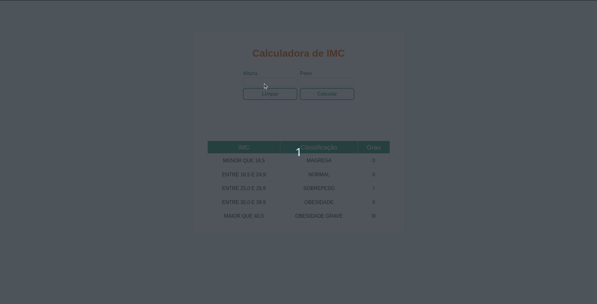

# Jogo da forca

Esse projeto consiste em uma simples calculadora de IMC, desenvolvida com React.js.

## Demonstração

<p aling="center">
  
</p>

## Rodando localmente

Clone o projeto

1. Clone o projeto

```bash
  git clone git@github.com:JonasTiago/calculadora-imc.git
```

2. Entre no diretório do projeto

```bash
  cd calculadora-imc
```

3. Instale as dependências

```bash
  npm install
```

4. Inicie o app

```bash
  npm start
```


## Stack utilizada

**Front-end:** React